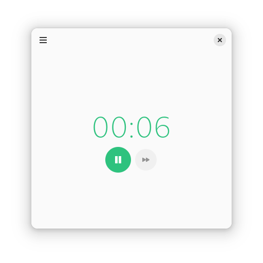
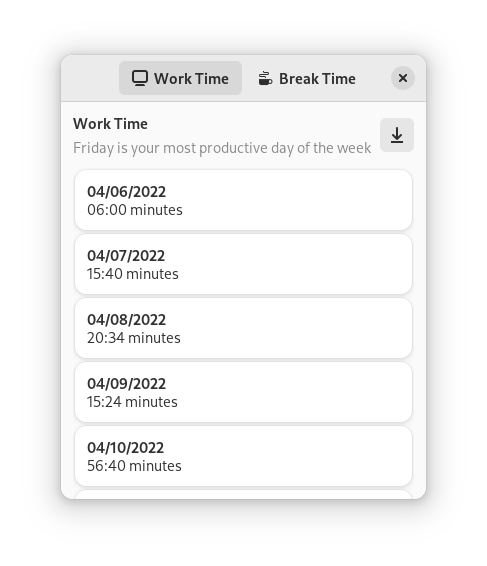

<div align="center">
	</img>

# Flowtime

**Get what motivates you done, without losing concentration**

<a href="https://flathub.org/apps/details/io.github.diegoivanme.flowtime">
    
</a>

</div>

## Gallery:

<div align="center">
	</img>
	</img>
	</img>
</div>

## Features:

* Assistant for the Flowtime working technique
* Assisted time calculations for breaks
* Customizable tones for the end of the break
* Notification that alerts you when your break is done
* Work and break time statistics
* Export your statistics to CSV

## Why?

The Pomodoro technique is efficient for tasks you find boring, but having to take a break when you are 100% concentrated in something you like might be annoying. That's why the Flowtime technique exists: take appropriate breaks without loosing your **flow**.

## How does it work?

The time you worked is divided by 5, and that's the break time you'll take. E.g, if you worked for 50 minutes, you'll take a 10 minute break, if you worked for 2 hours, you'll take a 24 minute break.

## Installing and Running

### Flathub

The only official distribution format for Flowtime is the Flatpak package available on Flathub. Click on the banner on the top of this README.md to go to Flowtime's Flathub page. Any other unofficial distribution format that might be available is highly disencouraged.

### AUR

There's third-party, unofficial AUR packages:

| Package        | Mantainer    |
| -------------- | ------------ |
| `flowtime`     | igor-dyatlov |
| `flowtime-git` | igor-dyatlov |

### Building from source

#### Flatpak and GNOME Builder

GNOME Builder provides a high quality Flatpak integration. All dependencies, runtimes and SDK extensions necessary will be installed by the application if they're not available. Just click the "Run" button and the app will be built :smile:.

#### Requirements

| Dependency | Version |
| ---------- | ------- |
| Meson | 0.5.9 |
| gtk-4  | 4.4.6 |
| gstreamer-1.0 | 1.0 |
| gstreamer-player-1.0 | 1.0 |
| libadwaita-1 |  1.2 |
| libxml-2.0 |  1.0 |

To compile and install, run:

```sh
meson builddir --prefix=/usr
cd builddir
sudo ninja install
flowtime
```
